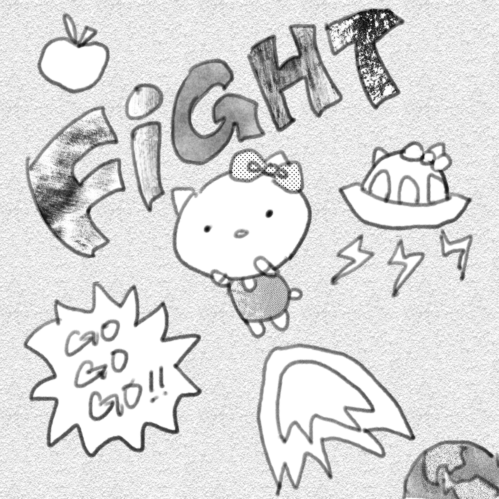

Hello! I'm Herena Li, a developer and artist from Hong Kong. I'm an upcoming third-year student specialising in Computer Science at the University of Toronto.

I've always loved making and creating things. As a child, I loved DIY-ing and made all sorts of stuff, from bead necklaces to clay figures. Admittedly, they didn't look very good, but I still enjoyed having made something with my own two hands. Eventually, I got into drawing and started creating my own illustrations and even original characters.

When I first learned about programming, I didn't expect to get very invested - after all, it seemed like something quite different from my other hobbies. Yet, as I learned more, I realized coding and my other hobbies shared something in common - they were all about *creating* something. Connected by string, hundreds of individual beads come together to become a necklace. On pieces of paper, thousands of strokes shape a picture. On a computer, millions of ones and zeroes form the basis of the program which I am currently using to type all of this out. I became fascinated by just how much a girl with a laptop and a dream could create.

Right now, I'm most interested in full-stack development. Other than that, I'm interested in learning more about computational linguistics, and I'm always looking to learn new things!

## Skills

### Languages

- Python
- Java
- SQL
- Javascript
- Typescript
- HTML/CSS
- C
- Haskell
- R
- Assembly

### Frameworks

- React
- Node.js
- Spring Boot
- JUnit
- FastAPI
- WordPress

### Developer Tools

- Git
- GitHub
- Visual Studio Code
- PyCharm
- IntelliJ
- WebStorm
- Postman

## Interests

Outside of computer science, I like drawing and doing digital art! I have been drawing for over 8 years and am familiar with various digital art programs, like Adobe Photoshop, Clip Studio Paint and Procreate.

As you can probably tell from the picture, I'm a big fan of Hello Kitty! I'm also into anime, manga and gacha games. My personal recommendation is the Japanese mobile game Promise of Wizard. (My MurrBot project was also inspired by this game!)
