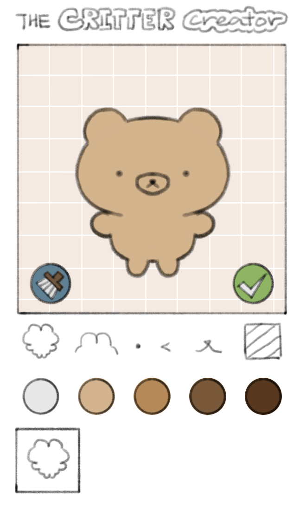
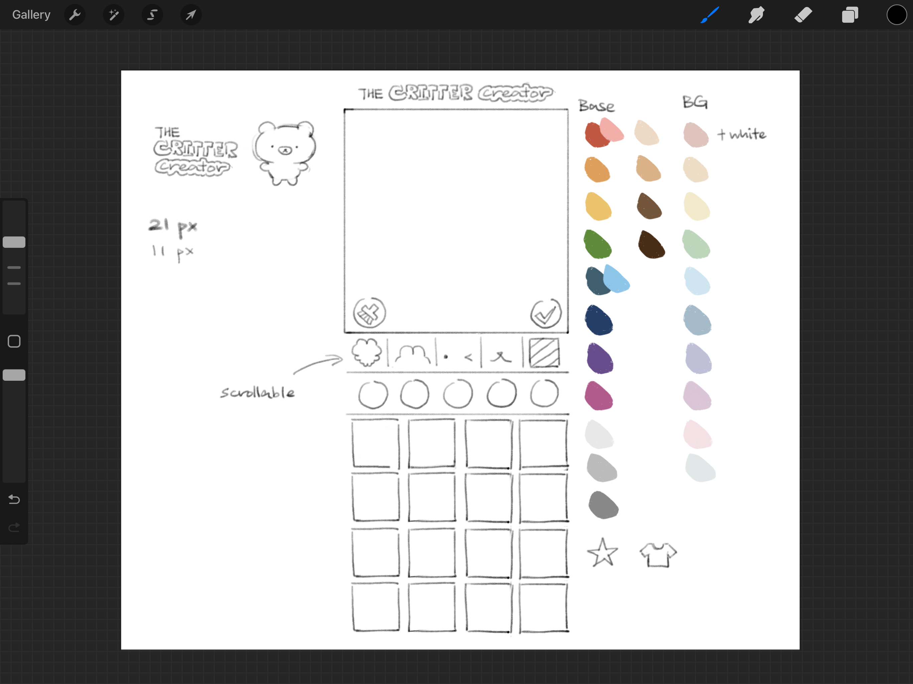
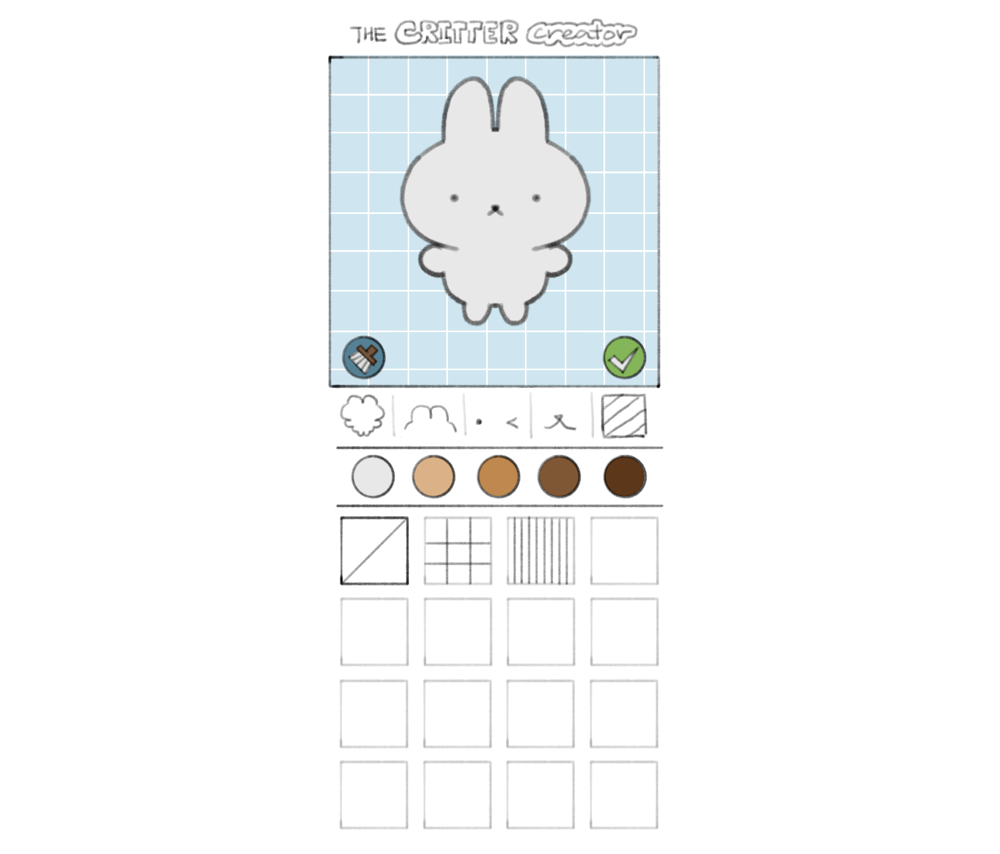

## Overview

The Critter Creator is a simple dress-up game where players can design their own critter, made using HTML, CSS and Javascript. All assets in the game were made by me! Try it out for yourself [here](https://critter-creator.surge.sh/), or check out the GitHub repo [here](https://github.com/herenali/critter-creator).

## Critter Creator: Origins

The Critter Creator is basically my own version of a [Picrew](https://picrew.me/en). If you don't know what Picrew is, it is a website that allows people to create and upload their own image makers, which are referred to as "Picrews". Creators can then share their Picrews to the world and let anyone play around with it! That might sound a bit confusing, but a Picrew is really just a dress-up game with even less limitations.

I've fiddled around with the website before, and it's honestly really fun! Some really talented artists have made Picrews and they look simply amazing. There are also some cute and interesting Picrews, like [this one](https://picrew.me/en/image_maker/2075394) which lets you customize your own animal-themed cream soda! Picrew is an amazing website, and I really recommend checking it out if you ever need visuals for an original character! Just be sure to check the persmissions set by the creator of each Picrew before you use or share your newly created image.

As a beginner developer with some free time, I wanted to get my hands dirty and start working on some projects. However, I quickly ran into a problem known as *tutorial hell*. I followed a bunch of tutorials and got to work on a bunch of projects, but those never felt like *my* projects.

When the idea of this project first popped up in my head, I immediately knew that this was the *the* project. This was the perfect project - not overwhelmingly difficult for a beginner like me, yet interesting and challenging. It was also the perfect mix of two of my main interests: coding and art.

## Creating the assets

I first drew out a mockup of the website in Procreate. Although the layout of the website is mainly inspired by Picrew's layout, I also put my own spin on the design, going for a hand-drawn feel with the logo, buttons and assets.

One thing that surprised me about the asset creation process was the number of assets I needed to make. For each part of the critter, I needed to draw both the lineart and the base color. I decided that the best and quickest way I could finish all assets was by splitting up the lineart and base color into two separate layers rather than combining them as one asset. That way, I could save time copying and pasting the lineart for each color option of a body part.

In the end, I designed over 100 unique assets. You can create thousands of unique critter combinations in the game!

## Coding and deployment

The coding process consisted of lots and lots of trial and error, but I eventually got everything to work out. I spent lots of time fiddling around in CSS trying to make the website layout look good, and I think that time was well spent.

When I searched up ways to deploy a static website, tons of options popped up. However, the one that stood out to me was [Surge](https://surge.sh/) due to its ease of use. I didn't think that deploying a site could be this easy, yet Surge proved me wrong. With Surge, my website was deployed in seconds. Click [here](https://critter-creator.surge.sh/) to check out my site!

## Final thoughts

If I could start over again, there are lots of things about the code that I would change. But I also see that as a good thing - I know I definitely learned something from this project!
