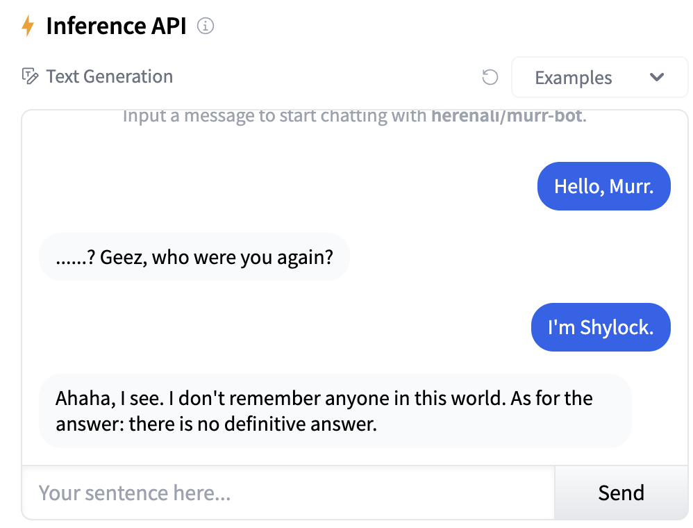

## Overview

MurrBot is an AI chatbot that uses the [Microsoft DialoGPT conversational model](https://huggingface.co/microsoft/DialoGPT-medium). It was fine-tuned on lines of the character Murr from the Japanese mobile game *Mahoustukai no Yakusoku*, also known as [Promise of Wizard](https://mahoyaku.com/).

The GitHub repo for this project can be found [here](https://github.com/herenali/mhyk-discord-chatbot), and the dataset that I used to train this model can be found on [Kaggle](https://www.kaggle.com/datasets/herenali/promise-of-wizard-main-story-script).

This model is hosted on [**Hugging Face**](https://huggingface.co/herenali/murr-bot). You can chat with it directly in the hosted inference API, or go to [this link](https://huggingface.co/spaces/herenali/murr-bot) to use the demo app hosted on Hugging Face Spaces.

Alternatively, you can invite the bot to your Discord server by clicking [here](https://huggingface.co/spaces/herenali/murr-discord-bot) and following the listed instructions! Once the bot is added to the server, you can call the bot using /chat and continue chatting with the bot in the created thread.

## << Eanul Rambul >>

> Murr Hart. His professions are: a jeweler, a philosopher, a professor of mineralogy, an astronomer, a mathematician, an inventor, a renowned scholar.... ... One phrase is enough: "A lunatic genius."

The MurrBot model was trained on the lines of Murr, an eccentric wizard whose soul was shattered by the moon. << Eanul Rambul >> is the spell that Murr uses to cast magic.

This project was mainly inspired by [this Github repo](https://github.com/RuolinZheng08/twewy-discord-chatbot). The code in the Jupyter notebook I used to train the model was adapted from the aformentioned repo, [this Medium article](https://towardsdatascience.com/make-your-own-rick-sanchez-bot-with-transformers-and-dialogpt-fine-tuning-f85e6d1f4e30) and [this tutorial](https://nathancooper.io/i-am-a-nerd/chatbot/deep-learning/gpt2/2020/05/12/chatbot-part-1.html).

## Parsing the data and training the model

Thanks to the hard work of the translation team **healingbonds** on [Dreamwidth](https://healingbonds.dreamwidth.org/61347.html), many stories from Promise of Wizard have been translated into English. For this model, I used the scripts from part 1 of the main story and Murr's affection story. Next, I parsed the raw text files using pandas and separated the character names and dialogue lines. The final csv file that was used to train the model can be found [here](https://www.kaggle.com/datasets/herenali/promise-of-wizard-main-story-script).

The model training process was relatively straightforward. In a Jupyter notebook, I converted my dataset into a format that my model could read. Since I only have a small dataset, actually training the model took less than ten minutes.

## Deployment

Once I finished training the model, the next step was deploying the model. I had one goal in mind: to get MurrBot working as a Discord bot. Unfortunately, this process was not as easy as I had first hoped.

Firstly, I deployed my newly trained model to the Hugging Face Hub. This part went smoothly and I was quickly able to chat with MurrBot using Hugging Face's built-in inference API.

*Try MurrBot out for yourself [here](https://huggingface.co/herenali/murr-bot)!*

Initially, my plan was to call Hugging Face's inference API and the Discord API directly from a Python file running on [Replit](https://replit.com/~). However, I ran into an issue where the payload would not parse properly. When hours of debugging and searching for solutions did not fix my problem, I decided that I would have to figure out a plan B.

Thankfully, there is another way to deploy a Discord bot from a model hosted on Hugging Face. After deploying my model to Hugging Face Spaces, I used the gradio module to deploy my Discord bot. Now, my bot is up and running!

## Final thoughts

Although things did not go as smoothly as I first expected, I really enjoyed working on this project. With this project now under my belt, I'll hopefully be able to train and fine-tune even better and more impressive models!
